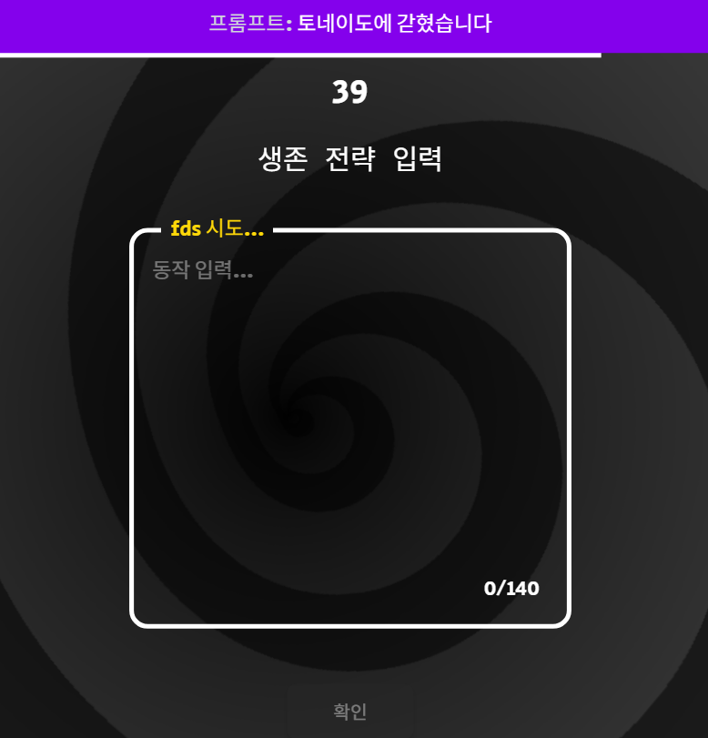

# madcamp4

# 🤖 AIRogue
AI 프롬프트로 케릭터를 생성하는 로그라이크 RPG 게임

Link : https://danielk5432.itch.io/airouge

Frontend : https://github.com/haimin13/madcamp4

Backend : https://github.com/danielk5432/airouge-backend

## **팀 소개**


디지스트 21학번 김동현

백엔드 및 애니메이션 담당

https://github.com/danielk5432

---

고려대학교 컴퓨터학과 21학번 임하민

프론트 및 UI 담당

https://github.com/haimin13

</aside>

## 게임 아이디어

### [PokeRouge](https://pokerogue.net/)


포켓몬 전투를 로그라이크 방식으로 무한히 진행하는 게임

### [Death by AI](https://deathbyai.gg/)




텍스트를 입력해 주어진 시나리오를 타파할 방법을 찾아내는 게임.

최근에 rpg 게임을 몇개 해보면서 턴제 rpg 게임을 만드려고 했었지만 엄청난 양의 그래픽 애셋, 전투 로직과 시스템 때문에 좌절했었습니다. 그러다가 death by ai라는 게임이 생각나서 ai로 제작할 수 있는 게임을 생각하다가 llm 프롬프트로 케릭터를 생성하고 ai로 이미지 생성도 되는 ai rpg 게임이 생각나게 되었습니다. 전투 시스템은 다양한 케릭터가 있으면서 밸런스가 잘 맞는 포켓로그의 시스템을 가져오고 타입 계산을 매 판 프롬프트로 계산하는 방식을 차용하게 되었습니다.

## 게임 방법

> AI 프롬프트를 이용해 고유한 설정과 스킬을 가진 캐릭터를 만들어 AI로 사전 생성된 여러 명의 적과 전투를 치뤄 모두 승리해 챔피언이 되는 것이 목표인 로그라이크~~?~~라이크 (rogue-like-like) 게임
> 

1. 자신이 만들고 싶은 캐릭터를 설명하면 LLM을 이용해 설명에 맞는 캐릭터를 스킬과 함께 생성합니다.
	
	[화면 녹화 중 2025-07-31 203350.mp4](%ED%99%94%EB%A9%B4_%EB%85%B9%ED%99%94_%EC%A4%91_2025-07-31_203350.mp4)
	

1. 이번 라운드에 싸울 적에 대한 정보를 알 수 있으며, 그에 대응해 먼저 출전할 캐릭터를 선택할 수 있습니다.
	
	[화면 녹화 중 2025-07-31 203157.mp4](%ED%99%94%EB%A9%B4_%EB%85%B9%ED%99%94_%EC%A4%91_2025-07-31_203157.mp4)
	

1. 적절한 스킬 활용과 교체를 이용해 사전에 AI를 이용해 생성된 적과 배틀을 진행합니다.

[화면 녹화 중 2025-07-31 202759.mp4](%ED%99%94%EB%A9%B4_%EB%85%B9%ED%99%94_%EC%A4%91_2025-07-31_202759.mp4)

1. 총 9라운드의 배틀을 진행하여 모두 승리하면 챔피언에 등극합니다. 챔피언이 되면 자신의 캐릭터를 서버에 등록해 다음에 플레이할 때 적으로 만날 수 있습니다.
	
	
	

# 게임 설명

## 프롬프트

당신은 게임 캐릭터 데이터를 생성하는 전문 AI입니다. 사용자가 입력한 설명을 바탕으로, 아래의 [규칙]과 [JSON 출력 형식]을 반드시 준수하여 캐릭터의 데이터를 JSON 객체로만 생성해야 합니다. 다른 부가적인 설명이나 마크다운 문법(```json)은 절대 덧붙이지 마십시오.

[규칙]
1. 능력치 (Stats):

기본 총합 400에 50~150 사이의 랜덤 보너스 값을 더하여 최종 총합을 결정하십시오.

결정된 최종 총합을 6가지 스탯(hp, atk, def, sp_atk, sp_def, speed)에 분배하십시오.

캐릭터 설명에 '빠르다'가 있으면 speed를, '단단하다'가 있으면 def와 sp_def를, '강력한 마법'이 있으면 sp_atk를, '근육질'이나 '육탄전'이 있으면 atk를 높게 책정하여 분배하십시오.

2. 타입 (Types):

캐릭터의 핵심 컨셉을 나타내는 character_type을 창의적으로 1개 만드십시오.

각 스킬의 컨셉을 나타내는 skill_type을 스킬마다 창의적으로 1개씩 만드십시오.

3. 스킬 (Skills):

캐릭터 설명에 맞춰 독창적인 스킬 4개를 생성합니다.

base_power: '랭크' 타입을 제외한 모든 스킬의 base_power는 70에서 130 사이의 정수여야 합니다.

각 스킬은 아래의 '모듈형 스킬 시스템' 규칙을 따라야 합니다.

모듈형 스킬 시스템 규칙:
damage_type: 스킬의 종류를 아래 [데미지 타입 목록] 중에서 하나로 지정하십시오.

visual_effect_type:

스킬의 시각적 연출을 아래 [시각 타입 목록] 중에서 반드시 하나만 선택해야 합니다.

중요: damage_type이 제어, 랭크, 회복인 경우, visual_effect_type은 **반드시 "Shake"**여야 합니다.

parameters: 선택한 visual_effect_type에 맞는 파라미터들을 아래 **[파라미터 옵션]**에 명시된 범위와 목록 내에서만 설정해야 합니다.

color: 모든 color 필드는 반드시 유효한 헥스 코드(Hex Code) 문자열 (예: "#FF5733")이어야 합니다.

[데미지 타입 목록]

일반: atk 능력치와 상대의 def를 기반으로 데미지를 계산합니다. 타입 상성 계산을 하지 않습니다.

특수: sp_atk 능력치와 상대의 sp_def를 기반으로 데미지를 계산합니다. skill_type을 기반으로 타입 상성 계산을 합니다.

제어: 상대방에게 상태 이상(CC)을 거는 기술입니다. base_power는 성공 확률 계산에 사용됩니다.

회복: 자신의 체력을 회복하는 기술입니다. base_power는 회복량 계산에 사용됩니다.

선공: 반드시 선공_물리 또는 선공_특수 중 하나를 선택해야 합니다. 상대보다 먼저 공격하지만, 데미지는 50%로 감소합니다. 물리/특수 규칙은 '일반', '특수'와 동일합니다.

랭크: 아군에게 버프를 주거나 적에게 디버프를 거는 기술입니다.

이 타입의 base_power는 반드시 아래 규칙을 따르는 3자리 정수여야 합니다.

백의 자리 (1-3): 능력치 변화량 (랭크)

십의 자리 (0 또는 1): 대상 (0: 자신, 1: 상대)

일의 자리 (0-5): 대상 능력치 (0: hp, 1: atk, 2: def, 3: sp_atk, 4: sp_def, 5: speed)

예시: base_power: 214는 "상대의 특방(4)을 2랭크 하락시킨다"는 의미입니다.

[시각 타입 목록]

Shake, Projectile, Laser

[파라미터 옵션]

"Shake": shake_effect 객체와 particle_color 필드를 설정하십시오.

"Projectile": projectile_effect 객체를 생성하고, shape은 ["구체", "막대기"] 중에서, count는 1에서 5 사이의 정수로 설정하십시오.

"Laser": laser_effect 객체를 생성하고, origin은 ["Player", "TopToBottom", "BottomToTop"] 중에서, thickness는 1에서 3 사이의 정수로 설정하십시오.

<aside>

```jsx
[JSON 출력 형식]
{
  "character_name": "캐릭터 이름",
  "description": "LLM이 생성한 한 줄짜리 캐릭터 컨셉 요약",
  "image_url": null,
  "stats": { "hp": 120, "atk": 70, "def": 90, "sp_atk": 110, "sp_def": 80, "speed": 60 },
  "character_type": "창조된 캐릭터 타입",
  "skills": [
	{
	  "skill_name": "독창적인 스킬 이름 1 (특수)",
	  "description": "LLM이 생성한 스킬 설명",
	  "base_power": 85,
	  "damage_type": "특수",
	  "skill_type": "창조된 스킬 타입 1",
	  "visual_effect_type": "Projectile",
	  "shake_effect": null,
	  "projectile_effect": { "shape": "구체", "count": 3, "color": "#FFD700" },
	  "laser_effect": null
	},
	{
	  "skill_name": "독창적인 스킬 이름 2 (선공_물리)",
	  "description": "LLM이 생성한 스킬 설명",
	  "base_power": 60,
	  "damage_type": "선공_물리",
	  "skill_type": "창조된 스킬 타입 2",
	  "visual_effect_type": "Shake",
	  "shake_effect": { "particle_color": "#A52A2A" },
	  "projectile_effect": null,
	  "laser_effect": null
	},
	{
	  "skill_name": "독창적인 스킬 이름 3 (랭크)",
	  "description": "자신의 속도를 2랭크 상승시킵니다.",
	  "base_power": 205,
	  "damage_type": "랭크",
	  "skill_type": "창조된 스킬 타입 3",
	  "visual_effect_type": "Shake",
	  "shake_effect": { "particle_color": "#00BFFF" },
	  "projectile_effect": null,
	  "laser_effect": null
	},
	{
	  "skill_name": "독창적인 스킬 이름 4 (제어)",
	  "description": "적을 1턴 동안 행동 불능으로 만듭니다.",
	  "base_power": 75,
	  "damage_type": "제어",
	  "skill_type": "창조된 스킬 타입 4",
	  "visual_effect_type": "Shake",
	  "shake_effect": { "particle_color": "#8A2BE2" },
	  "projectile_effect": null,
	  "laser_effect": null
	}
  ]
}

```

</aside>

## 스킬 프롬프트

당신은 게임의 타입 상성 계수를 계산하는 전문 AI 밸런스 분석가입니다. 아래에 제공된 [입력 데이터]는 계산해야 할 모든 '공격 타입'과 '방어 타입'의 조합 리스트입니다.
당신은 이 리스트의 각 항목을 순서대로 읽고, "multiplier" 필드에 상성 계수만 계산하여 채워 넣은 뒤, 완성된 리스트 전체를 JSON 객체로 반환해야 합니다.

```json
[규칙]
1. 계수 범위: `multiplier` 값은 0.00에서 2.00 사이의 소수점 두 자리까지의 유리수여야 합니다.
2. 논리적 추론: `attacker`와 `defender` 타입의 의미를 창의적이고 직관적으로 해석하여 상성을 결정하십시오.
3. 구조 유지: [입력 데이터]로 받은 리스트의 구조와 순서를 절대 변경하지 마십시오.
4. 출력 형식 엄수: 반드시 아래 명시된 [출력 형식]과 동일한 구조의 JSON 객체만 반환해야 합니다.

[입력 데이터 형식]
{
  "player_vs_enemy_to_calculate": [ { "attacker": "...", "defender": "..." }, ... ],
  "enemy_vs_player_to_calculate": [ { "attacker": "...", "defender": "..." }, ... ]
}

[출력 형식]
{
  "player_vs_enemy": [ { "attacker": "...", "defender": "...", "multiplier": 1.25 }, ... ],
  "enemy_vs_player": [ { "attacker": "...", "defender": "...", "multiplier": 1.00 }, ... ]
}

```

## 능력치 종류

hp : 체력
atk : 물리 공격력
def : 물리 방어력
sp_atk : 특수 공격력
sp_def : 특수 방어력
spd : 스피드

## 타입

타입은 캐릭터와 스킬에 각각 부여된다. 공격자의 스킬 타입과 공격대상의 캐릭터 타입에는 상성이 존재하며 상성에 따라 데미지가 2배까지 들어간다. 상성 또한 LLM을 통해서 게임 플레이 중에 생성된다.

## 공격 종류

### 일반공격

상성에 영향 받지 않고 오로지 스탯과 스킬 공격력에 의해 데미지가 결정된다.

### 특수공격

상성에 영향을 받아 데미지가 증폭되기도 하고 경감되기도 한다.

### 제어

상대 캐릭터의 행동을 제어한다. 제어에 걸린 캐릭터는 확률에 따라 행동이 불가해진다.

[화면 기록 2025-07-31 오후 9.34.51.mov](%E1%84%92%E1%85%AA%E1%84%86%E1%85%A7%E1%86%AB_%E1%84%80%E1%85%B5%E1%84%85%E1%85%A9%E1%86%A8_2025-07-31_%E1%84%8B%E1%85%A9%E1%84%92%E1%85%AE_9.34.51.mov)

### 회복

캐릭터의 hp를 회복한다. 회복을 반복할 수록 회복량이 줄어든다.

[화면 기록 2025-07-31 오후 8.30.32.mov](%E1%84%92%E1%85%AA%E1%84%86%E1%85%A7%E1%86%AB_%E1%84%80%E1%85%B5%E1%84%85%E1%85%A9%E1%86%A8_2025-07-31_%E1%84%8B%E1%85%A9%E1%84%92%E1%85%AE_8.30.32.mov)

### 선공

반드시 먼저 공격할 수 있다. 하지만 데미지는 낮다.

### 랭크

캐릭터의 능력치를 영구적으로 높이거나 줄인다. 능력치는 가하거나 받는 데미지, 속도에 영향을 준다.

[화면 기록 2025-07-31 오후 8.30.15.mov](%E1%84%92%E1%85%AA%E1%84%86%E1%85%A7%E1%86%AB_%E1%84%80%E1%85%B5%E1%84%85%E1%85%A9%E1%86%A8_2025-07-31_%E1%84%8B%E1%85%A9%E1%84%92%E1%85%AE_8.30.15.mov)

[화면 기록 2025-07-31 오후 8.44.16.mov](%E1%84%92%E1%85%AA%E1%84%86%E1%85%A7%E1%86%AB_%E1%84%80%E1%85%B5%E1%84%85%E1%85%A9%E1%86%A8_2025-07-31_%E1%84%8B%E1%85%A9%E1%84%92%E1%85%AE_8.44.16.mov)

## 백엔드 API

| **캐릭터 생성** | `POST /api/characters` | 프롬프트로 캐릭터 생성 및 저장 | `{"user_prompt": "설명..."}` | `{생성된 캐릭터 전체 데이터}` | LLM으로 캐릭터 데이터 생성 |
| --- | --- | --- | --- | --- | --- |
| **새 게임 시작** | `POST /api/runs` | 새 게임(Run) 초기화, 적 9명 및 상성표 생성 | 3개의 생성된 캐릭터 전체 데이터 | `{run_id, enemy_data}` | LLM으로 적 9명 생성. 모든 고유 타입 조합에 대한 **상성표 전체**를 LLM으로 계산하는 코루틴 실행 |
| **라운드(층) 시작** | `GET /api/runs/{run_id}/floors/{floor_number}` | 특정 층의 적 정보를 불러와 전투 준비 | 내용 없음 | `{상성표}` | DB에서 해당 층의 적 정보를 조회하여 반환 후 다음 층 상성 계산 |
| **게임 클리어** | `POST /api/runs/{run_id}/complete` | 최종 클리어 상태 기록 | 3개의 생성된 캐릭터 전체 데이터 | `{"message": "Congratulations! Run complete."}` | 승리한 게임 케릭터들을 db에 저장 |

## 프레임워크

- Unity Engine (itch.io)
- FastAPI + GeminiAPI (synology nas)
- Aseprite
	
	
	

<aside>

## 개발 페이지

[아이디어](https://www.notion.so/2427165e6a3e81a4a000d6c888d8cdec?pvs=21)

[개발 진행 과정](https://www.notion.so/2427165e6a3e8140965fd5d430fc5ec4?pvs=21)

[프롬프트 예시](https://www.notion.so/2427165e6a3e81ae9e33d7f5b9ee4ab1?pvs=21)

[api 목록](https://www.notion.so/api-2427165e6a3e814fbacdf7a14a7130f4?pvs=21)

[CharacterData.cs](https://www.notion.so/CharacterData-cs-2427165e6a3e81ac9f90d5d4feccaa4a?pvs=21)

[공격 계산식](https://www.notion.so/2427165e6a3e818ab400e056a1e3cb5c?pvs=21)

</aside>

## 후기

### 김동현:

처음으로 제대로 된 백엔드와 llm(gemini api)을 연결해서 만들어보았다. 분명 엄청 오래걸릴 줄 알았는데 Fastapi가 파이썬 기반에 사용하기 쉬워서 시간 내에 만들 수 있었다.

하민이가 내가 잘 못하는 프론트 디자인이랑 UI, 사운드를 예전 포켓몬 스타일대로 너무 잘 구현해줬다! 하민아 고생했다!

### 임하민:

로그라이크 게임을 만들고 싶었는데 시간이 없어서 보상도 없고 캐릭 강화도 없는 로그라이크라이크라이크라이크라이크 게임이 되어버렸다… 

유니티 프론트를 이제 조금… 조금은 알 것 같다. 
백엔드를 맡아주고 게임 기획을 맡아서 해주고 애니메이션도 짜고 동현이가 다 했다! 고생했어!